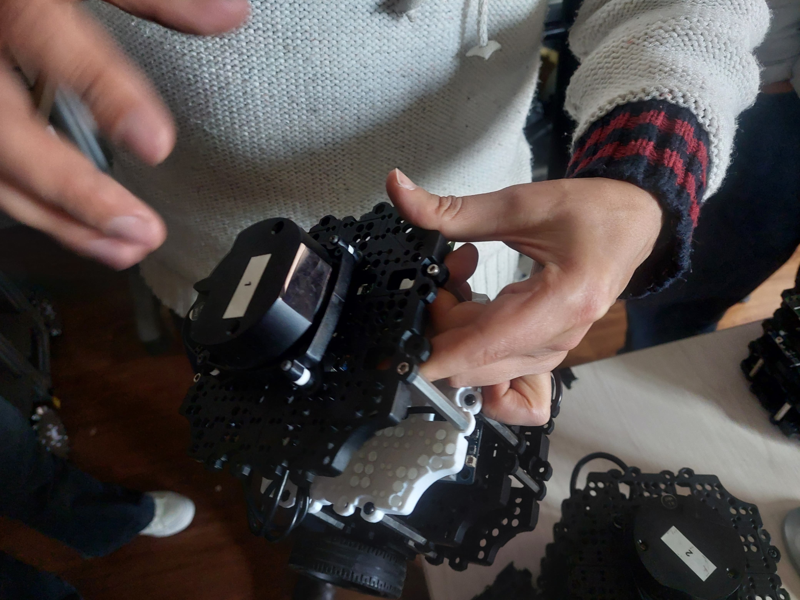

## 🏛️Tipos-De-Sensores-USTA-
En este repositorio de GitHub vamos a encontrar los tipos de sensores que se encuentran en los diferentes laboratorios de la Universidad Santo Tomás, sede central.
## <h2>
 <b> Sensor de Tempertura  </b> </h2>  
<h2>
 <b>  </b> </h2>
Este es un sensor de temperatura tipo termopar, funciona basándose en el Efecto Seebeck. Este efecto establece que cuando dos metales distintos se unen por ambos extremos formando un circuito, y existe una diferencia de temperatura entre una de las uniones ("unión caliente" o de medida) y la otra ("unión fría" o de referencia), se genera una pequeña tensión eléctrica (milivoltios) proporcional a esa diferencia de temperatura.

## <h2>
 <b> Sensor De Nivel Liquido </b> </h2>
<h2>
 <b>  </b> </h2>
Este sensor permite medir el nivel de liquido, un flotador mueve físicamente el cursor de una resistencia variable, cambiando su valor óhmico para indicar electrónicamente cuán lleno está un tanque. 

## <h2>
 <b> Sensor Anemometro </b> </h2> 
<h2>
 <b>  </b> </h2>
Este tipo de sensor e un sistema compuesto por cazoletas helicoidales que se basa fundamentalmente en la conversión de la energía cinética del viento en movimiento mecánico de rotación, y luego en una señal eléctrica medible.

## <h2>
 <b> Sensor Inductivo </b> </h2> 
<h2>
 <b>  </b> </h2>
Un sensor inductivo opera mediante el principio de inducción electromagnética. Internamente, contiene una bobina que genera un campo magnético alterno. Cuando un objeto metálico (ferroso o no ferroso) entra en ese campo se inducen corrientes de Foucault y el cambio es detectado por el circuito interno, que genera una señal de salida.

## <h2>
 <b> Sensor Ultrasonido </b> </h2>  
<h2>
 <b>  </b> </h2>
Un sensor de ultrasonido se basa en el principio de eco por tiempo de vuelo (time of flight), contiene un transductor piezoeléctrico que convierte energía eléctrica en ondas acústicas de alta frecuencia.

## <h2>
 <b> Termometro IR Mini Extech IR100 </b> </h2> 
<h2>
 <b>  </b> </h2> 
Es un termometro infrarrojo sin contacto diseñado para medir la temperatura superficial de objetos sin necesidad de tocarlos, lo que lo hace ideal para superficies calientes, de difıcil acceso o potencialmente peligrosas. Su rango de medicion va desde -34 a 446 °F(-33 a 230 °C), ofreciendo precision y rapidez en la lectura

## <h2>
 <b>  Sensor Capacitivo </b> </h2> 
<h2>
 <b>   </b> </h2> 
Un sensor de proximidad capacitivo, como el Autonics CR18-8DP, se utiliza en la
automatizacion industrial para detectar una gran variedad de materiales, desde metales hasta plasticos, liquidos, madera o materiales a granel. Ademas de identificar la presencia o ausencia de objetos, resulta muy util en la medicion de niveles en tanques o contenedores, incluso a traves de paredes no metalicas, en la deteccion de fugas de lıquidos o vapor, y en el control de procesos como verificar el llenado de envases o la colocacion de tapas en lıneas de produccion.

## <h2>
 <b> Sensor Fotoelectrico </b> </h2>
<h2>
 <b>  </b> </h2>
Un sensor fotoelectrico es un dispositivo que detecta objetos sin contacto usando un haz  de luz visible o infrarroja. Funciona con un emisor y un receptor: cuando un objeto interrumpe o refleja el haz, el sensor lo identifica y envia una señal electrica. Los principales tipos son: de barrera (emisor y receptor separados), reflectivo (emisor y receptor juntos, detecta la luz reflejada por el objeto) y retrorreflector (usa un reflector para devolver la luz). Se utilizan ampliamente en automatizacion, seguridad y control industrial por su precision y fiabilidad

## <h2>
 <b> Sensor LiDAR </b> </h2>  
<h2>
 <b>  </b> </h2>  
El sensor LiDAR (Light Detection and Ranging) es un dispositivo que mide distancias y genera mapas en 2D o 3D utilizando pulsos de luz láser. Funciona emitiendo un haz láser que rebota en los objetos del entorno, midiendo el tiempo que tarda en regresar al sensor (principio de **Time of Flight**). De esta forma se obtiene una representación precisa de las distancias y formas. Los LiDAR pueden ser de escaneo rotativo, solid-state o flash, cada uno con diferentes alcances y resoluciones. Se emplean en múltiples campos como la robótica móvil, los vehículos autónomos, la topografía, el modelado 3D y sistemas de seguridad industrial por su gran precisión y fiabilidad.  

## <h2>
 <b> Referencias </b> </h2>
1. Extech Instruments. IR100 Mini IR Thermometer. Instrumart, 2025. Disponible en: https://www.instrumart.com/products/25829/extech-ir100-mini-ir-thermometer
2. Omega Engineering. Temperature Sensors – Thermocouples, RTDs, Thermistors. 2023. Disponible en: https://www.dwyeromega.com/en-us/resources/temperaturesensors
3. Industrias Asociadas. Sensores Fotoel´ectricos Reflex. 2024. Disponible en: https://www.industriafotoelectricos-reflex/3
4. Rechner Sensors. Sensor Inductivo. 2018. Disponible en: https://www.rechnersensors.com/es/documentacion/knowledge/sensor-inductivo
