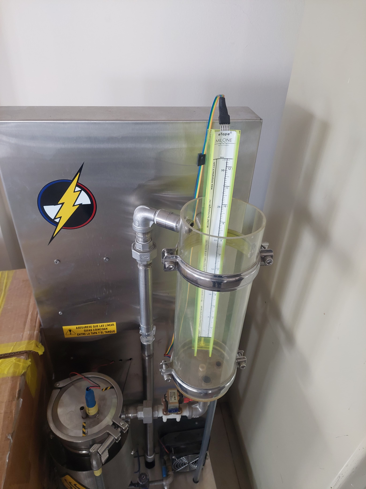
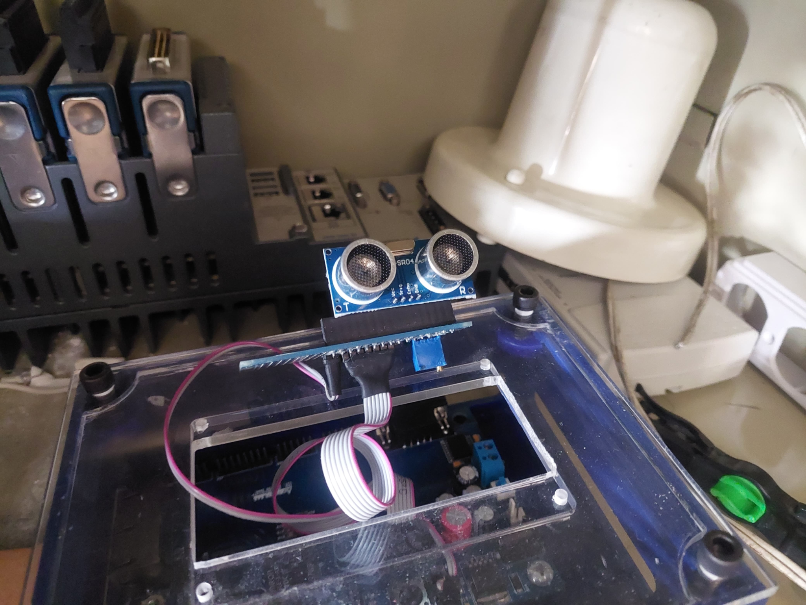

# 📡 Sensores - Comunicaciones Industriales

Este repositorio documenta diferentes sensores utilizados en los laboratorios de la **Universidad Santo Tomás** (sede central, Bogotá) como parte del curso de **Comunicaciones Industriales**.  

Cada sensor incluye su **descripción**, **principio de funcionamiento**, **aplicaciones prácticas** y **fotografía tomada en el laboratorio**.

---

## 🌡️ 1. Sensor de Temperatura (Termopar)

**Descripción:** Sensor tipo termopar que mide la temperatura basándose en el **Efecto Seebeck**.  
**Principio de funcionamiento:** La unión de dos metales distintos genera una tensión proporcional a la diferencia de temperatura entre la unión caliente y la de referencia.  
**Aplicaciones:** Procesos industriales de alta temperatura, hornos, motores, control de procesos.  

---

## 💧 2. Sensor de Nivel de Líquido

**Descripción:** Sensor resistivo con flotador para medir el nivel de líquido en tanques.  
**Principio de funcionamiento:** El flotador mueve el cursor de una resistencia variable, alterando su valor óhmico según el nivel.  
**Aplicaciones:** Monitoreo de tanques, sistemas de bombeo, control de procesos hidráulicos.  

---

## 🌬️ 3. Anemómetro (Velocidad del Viento)

**Descripción:** Dispositivo de cazoletas giratorias que mide la velocidad del viento.  
**Principio de funcionamiento:** Convierte la energía cinética del aire en rotación mecánica y luego en señal eléctrica.  
**Aplicaciones:** Meteorología, ventilación, estaciones climáticas, energías renovables.  

---

## 🔄 4. Sensor Inductivo

**Descripción:** Detecta la presencia de metales sin contacto físico.  
**Principio de funcionamiento:** Una bobina interna genera un campo magnético alterno; cuando un objeto metálico ingresa, se inducen corrientes de Foucault detectadas por el circuito.  
**Aplicaciones:** Automatización industrial, detección de piezas metálicas, sistemas de posicionamiento.  

---

## 📡 5. Sensor Ultrasónico

**Descripción:** Sensor que mide distancias mediante ultrasonido.  
**Principio de funcionamiento:** Emite pulsos ultrasónicos y mide el tiempo de retorno (ToF).  
**Aplicaciones:** Robótica, detección de obstáculos, control de nivel sin contacto, seguridad.  

---

## 🌡️ 6. Termómetro IR (Extech IR100 Mini)

**Descripción:** Termómetro infrarrojo portátil para medir temperatura superficial sin contacto.  
**Principio de funcionamiento:** Detecta radiación infrarroja emitida por los objetos y la convierte en temperatura.  
**Rango:** -34 a 446 °F (-33 a 230 °C).  
**Aplicaciones:** Superficies calientes, zonas peligrosas, control rápido en procesos industriales.  

---

## ⚡ 7. Sensor Capacitivo

**Descripción:** Sensor de proximidad capacitivo capaz de detectar distintos materiales (metales, plásticos, líquidos, madera, etc.).  
**Principio de funcionamiento:** Detecta variaciones en capacitancia al acercarse un objeto o material.  
**Aplicaciones:** Medición de niveles en tanques, detección de fugas, control de llenado en líneas de producción.  

---

## 🔆 8. Sensor Fotoeléctrico

**Descripción:** Dispositivo que detecta objetos sin contacto usando un haz de luz (visible o infrarroja).  
**Principio de funcionamiento:** Consta de un emisor y receptor; al interrumpirse o reflejarse el haz, se genera una señal eléctrica.  
**Tipos:** Barrera, reflectivo y retrorreflector.  
**Aplicaciones:** Automatización, seguridad industrial, control de procesos y sistemas de conteo.  

---

## 📚 Referencias
1. Extech Instruments. *IR100 Mini IR Thermometer*. Instrumart, 2025.  
2. Omega Engineering. *Temperature Sensors – Thermocouples, RTDs, Thermistors*. 2023.  
3. Industrias Asociadas. *Sensores Fotoeléctricos Reflex*. 2024.  
4. Rechner Sensors. *Sensor Inductivo*. 2018.  

---

> 📌 **Nota:** Este material es de uso académico y corresponde al registro fotográfico y técnico de los equipos disponibles en los laboratorios de la Universidad Santo Tomás.
es/documentacion/knowledge/sensor-inductivo
